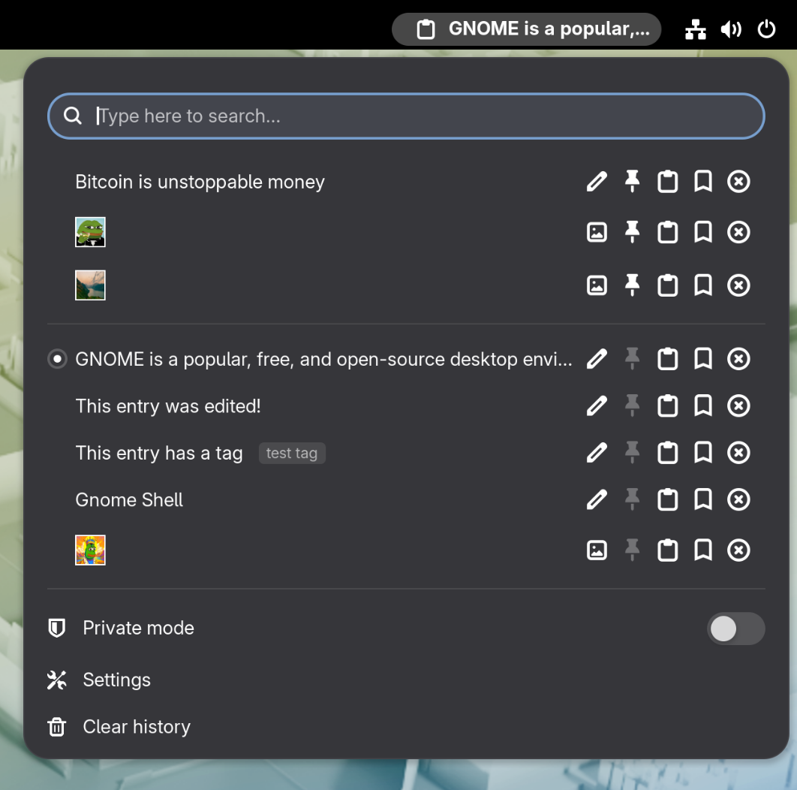

# 📋 Clipboard Indicator

[](https://extensions.gnome.org/extension/779/clipboard-indicator/)


The most popular, reliable and feature-rich clipboard manager for GNOME with
over **2M** downloads.



This extension is also packaged by the community for many popular Linux distros
— search your package manager.

## 🧰 Features

* **Image support** — Copy and paste images in addition to text
* **Pin items** — Keep important clipboard entries at the top of the menu
* **Search** — Find clipboard entries with text search, including regex
* **Edit entries** — Modify existing text entries
* **Tag entries** — Add custom labels to organize your clipboard
* **Keyboard shortcuts** — Open/close menu, cycle through entries and activate actions without touching the mouse
* **Auto-clear history** — Schedule automatic clipboard cleanup at regular intervals or at boot time
* **Private mode** — Temporarily pause clipboard history when working with sensitive data
* **Exclude apps** — Prevent clipboard tracking when specific applications are in focus (e.g., password managers)
* **Highly configurable** — Many more settings to control UI & behavior

### In-Menu Keyboard Controls

- Use arrows to navigate
- `<Enter>` to select an item
- `<Delete>` to delete an item
- `v` to paste directly from menu
- `p` to pin item
- `t` to add a tag
- `h` to preview image
- `e` to edit entry

### Terminal support

Pasting from the menu works by sending Shift+Insert to programs or Ctrl+Shift+Insert to terminals.

- To use with tmux, add this to your `.tmux.conf`:

  ```bash
  # Add Ctrl Shift Insert to paste for clipboard-indicator
  bind -T root C-S-IC {
    run "tmux send-key \"$(xclip -d ${DISPLAY} -o -selection clipboard)\""
  }
  ```

- To use with Ghostty, add this to your `.config/ghostty/config`:

  ```bash
  # Add Ctrl Shift Insert to paste for clipboard-indicator
  keybind = ctrl+shift+insert=paste_from_clipboard
  ```

### Known issues

- Copying large images causes a short freeze
- Pasting via menu doesn't work for every application

## 📦 Install from source

Installation via git is performed by cloning the repo into your local gnome-shell extensions directory (usually `~/.local/share/gnome-shell/extensions/`):

```bash
$ git clone https://github.com/Tudmotu/gnome-shell-extension-clipboard-indicator.git <extensions-dir>/clipboard-indicator@tudmotu.com
```

After cloning the repo, the extension is practically installed yet disabled. In order to enable it, run the following command:

```bash
$ gnome-extensions enable clipboard-indicator@tudmotu.com
```

## ✅ GNOME Version Support

Depending on your GNOME version, you will need to install the following
Clipboard Indicator versions:

* GNOME 46 and above:
  * Use latest version
* GNOME 45:
  * v57
* GNOME 42-44
  * v47
* GNOME 40-41
  * v39
* GNOME <40
  * v37

## ⌨️ Contributing

Contributions to this project are welcome.

Please follow these guidelines when contributing:

- If you want to contribute code, your best bet is to look for an issue with the label "Up for grabs"
- DO NOT open unsolicited PRs unless they are for updating translations
- Look at the list of previous PRs before you open a PR, if your PR conflicts with another, it will be rejected
- If you have a feature idea, open an issue and discuss it there before implementing. DO NOT open a PR as a platform for discussion

### Release Cycle

This project loosely follows the release cycle of GNOME. That means it will
usually receive 2 updates a year, close to the release of a new major GNOME
version. If there are features you'd like to implement or suggest, it is advised
to start the discussion a month or two before a GNOME release.
