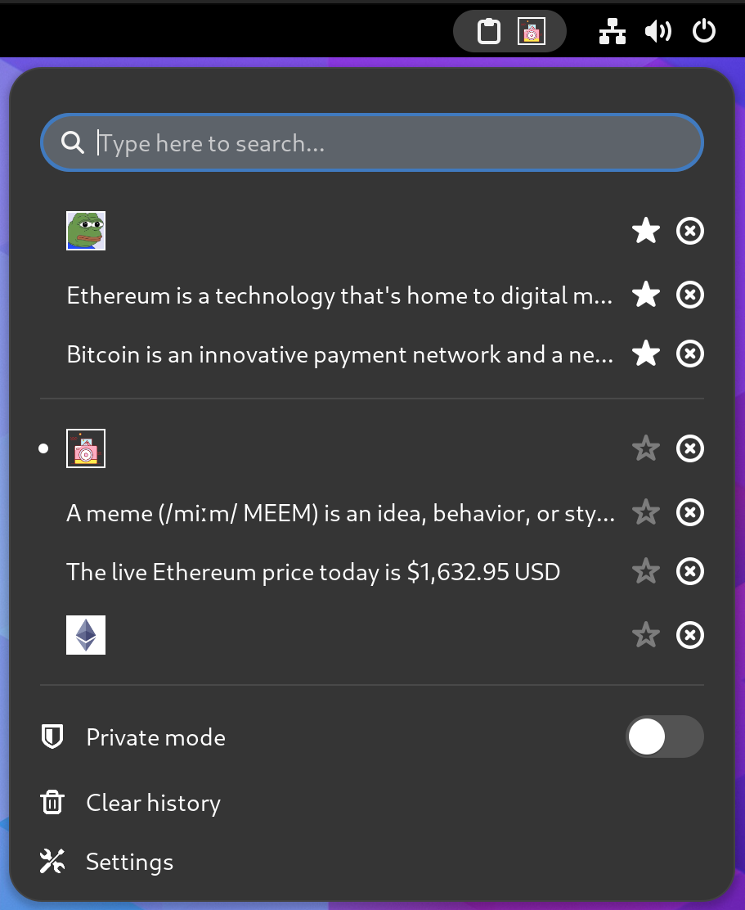

============================
📋 Clipboard Indicator
============================

.. image:: https://raw.githubusercontent.com/andyholmes/gnome-shell-extensions-badge/eb9af9a1c6f04eb060cb01de6aeb5c84232cd8c0/get-it-on-ego.svg?sanitize=true
   :target: https://extensions.gnome.org/extension/779/clipboard-indicator/
   :width: 180
   :alt: Get it on GNOME Extensions

The most popular, reliable and feature-rich clipboard manager for GNOME with
over **1M** downloads.

|Screenshot|

This extension is also packaged by the community for many popular Linux distros
— search your package manager.

🧰 Features:
----------------

- Highly customizable
- Supports both text and images
- Allows pinning items to top
- Includes a "private" mode
- Has configurable shortcuts
- Keyboard control

In-Menu Keyboard Controls
^^^^^^^^^^^^^^^^^^^^^^^^^^

- Use arrows to navigate
- :code:`v` to paste directly from menu
- :code:`p` to pin item
- :code:`<Delete>` to delete an item

📦 Install from source
----------------

Installation via git is performed by cloning the repo into your local gnome-shell extensions directory (usually :code:`~/.local/share/gnome-shell/extensions/`)::

    $ git clone https://github.com/Tudmotu/gnome-shell-extension-clipboard-indicator.git <extensions-dir>/clipboard-indicator@tudmotu.com

After cloning the repo, the extension is practically installed yet disabled. In order to enable it, run the following command::

    $ gnome-extensions enable clipboard-indicator@tudmotu.com

✅ GNOME Version Support
--------------------------
Depending on your GNOME version, you will need to install the following
Clipboard Indicator versions:

* GNOME 46 and above:

  * Use latest version

* GNOME 45:

  * v57

* GNOME 42-44

  * v47

* GNOME 40-41

  * v39

* GNOME <40

  * v37

⌨️ Contributing
----------------
Contributions to this project are welcome.

Please follow these guidelines when contributing:

- If you want to contribute code, your best bet is to look for an issue with the label "Up for grabs"
- DO NOT open unsolicited PRs unless they are for updating translations
- Look at the list of previous PRs before you open a PR, if your PR conflicts with another, it will be rejected
- If you have a feature idea, open an issue and discuss it there before implementing. DO NOT open a PR as a platform for discussion

Note: I have very little time to maintain this project, so expect long (months) of response time. Apologies in advance.
